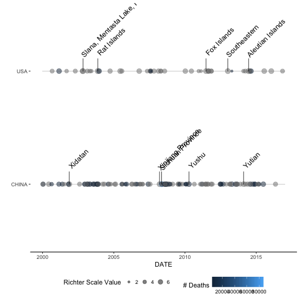
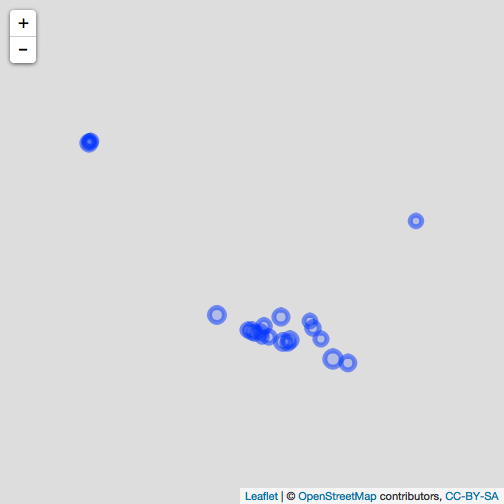

###### A package created for Coursera, using earthquake data from the NOAA.
###### The data used is specific to the NOAA. The purpose of this package is to
###### demonstrate reading in the data, showcasing an earthquake timeline, and
###### showing an interactive map of specific earthquakes.

#### Installation


```r
library(eqvis)
```


#### Reading In Data


```r
file_url <- "https://www.ngdc.noaa.gov/nndc/struts/results?type_0=Exact&query_0=$ID&t=101650&s=13&d=189&dfn=signif.txt"
raw_data <- read.delim(file_url)
```

#### Cleaning Up The Data


```r
cleaned_data_example <- eq_clean_data(raw_data)
```

```
## Warning: 238 failed to parse.
```

```r
head(cleaned_data_example)
```

```
##    I_D FLAG_TSUNAMI  YEAR MONTH DAY HOUR MINUTE SECOND FOCAL_DEPTH
## 1    1              -2150    NA  NA   NA     NA     NA          NA
## 2    2          Tsu -2000    NA  NA   NA     NA     NA          NA
## 3    3              -2000    NA  NA   NA     NA     NA          18
## 4 5877          Tsu -1610    NA  NA   NA     NA     NA          NA
## 5    8              -1566    NA  NA   NA     NA     NA          NA
## 6   11              -1450    NA  NA   NA     NA     NA          NA
##   EQ_PRIMARY EQ_MAG_MW EQ_MAG_MS EQ_MAG_MB EQ_MAG_ML EQ_MAG_MFA EQ_MAG_UNK
## 1        7.3        NA        NA        NA        NA         NA        7.3
## 2         NA        NA        NA        NA        NA         NA         NA
## 3        7.1        NA       7.1        NA        NA         NA         NA
## 4         NA        NA        NA        NA        NA         NA         NA
## 5         NA        NA        NA        NA        NA         NA         NA
## 6         NA        NA        NA        NA        NA         NA         NA
##   INTENSITY      COUNTRY STATE             LOCATION_NAME LATITUDE
## 1        NA       JORDAN            Bab-A-Daraa,Al-Karak   31.100
## 2        10        SYRIA                          Ugarit   35.683
## 3        10 TURKMENISTAN                               W   38.000
## 4        NA       GREECE        Thera Island (Santorini)   36.400
## 5        10       ISRAEL                 Ariha (Jericho)   31.500
## 6        10        ITALY                    Lacus Cimini   35.500
##   LONGITUDE REGION_CODE DEATHS DEATHS_DESCRIPTION MISSING
## 1      35.5         140     NA                 NA      NA
## 2      35.8         130     NA                  3      NA
## 3      58.2          40      1                  1      NA
## 4      25.4         130     NA                 NA      NA
## 5      35.3         140     NA                 NA      NA
## 6      25.5         130     NA                 NA      NA
##   MISSING_DESCRIPTION INJURIES INJURIES_DESCRIPTION
## 1                  NA       NA                   NA
## 2                  NA       NA                   NA
## 3                  NA       NA                   NA
## 4                  NA       NA                   NA
## 5                  NA       NA                   NA
## 6                  NA       NA                   NA
##   DAMAGE_MILLIONS_DOLLARS DAMAGE_DESCRIPTION HOUSES_DESTROYED
## 1                      NA                  3               NA
## 2                      NA                 NA               NA
## 3                      NA                  1               NA
## 4                      NA                 NA               NA
## 5                      NA                  3               NA
## 6                      NA                 NA               NA
##   HOUSES_DESTROYED_DESCRIPTION HOUSES_DAMAGED HOUSES_DAMAGED_DESCRIPTION
## 1                           NA             NA                         NA
## 2                           NA             NA                         NA
## 3                            1             NA                         NA
## 4                           NA             NA                         NA
## 5                           NA             NA                         NA
## 6                           NA             NA                         NA
##   TOTAL_DEATHS TOTAL_DEATHS_DESCRIPTION TOTAL_MISSING
## 1           NA                       NA            NA
## 2           NA                        3            NA
## 3            1                        1            NA
## 4           NA                        3            NA
## 5           NA                       NA            NA
## 6           NA                       NA            NA
##   TOTAL_MISSING_DESCRIPTION TOTAL_INJURIES TOTAL_INJURIES_DESCRIPTION
## 1                        NA             NA                         NA
## 2                        NA             NA                         NA
## 3                        NA             NA                         NA
## 4                        NA             NA                         NA
## 5                        NA             NA                         NA
## 6                        NA             NA                         NA
##   TOTAL_DAMAGE_MILLIONS_DOLLARS TOTAL_DAMAGE_DESCRIPTION
## 1                            NA                       NA
## 2                            NA                       NA
## 3                            NA                        1
## 4                            NA                        3
## 5                            NA                       NA
## 6                            NA                       NA
##   TOTAL_HOUSES_DESTROYED TOTAL_HOUSES_DESTROYED_DESCRIPTION
## 1                     NA                                 NA
## 2                     NA                                 NA
## 3                     NA                                  1
## 4                     NA                                 NA
## 5                     NA                                 NA
## 6                     NA                                 NA
##   TOTAL_HOUSES_DAMAGED TOTAL_HOUSES_DAMAGED_DESCRIPTION       DATE
## 1                   NA                               NA 2150-01-01
## 2                   NA                               NA 2000-01-01
## 3                   NA                               NA 2000-01-01
## 4                   NA                               NA 1610-01-01
## 5                   NA                               NA 1566-01-01
## 6                   NA                               NA 1450-01-01
```

#### Visualizing The Data On A Timeline


```r
ggplot(data=subset(cleaned_data_example, !is.na(EQ_PRIMARY) & COUNTRY %in% c("USA", "CHINA")),
 aes(x = DATE, y = COUNTRY, size = EQ_PRIMARY, xmin = as.Date('2000-01-01',"%Y-%m-%d"),
    xmax = as.Date('2016-12-31',"%Y-%m-%d"), color = DEATHS, fill = DEATHS, label = LOCATION_NAME)) +
  geom_timeline(alpha = .5) +
  scale_size_continuous(name = "Richter Scale Value") +
  scale_color_continuous(name = "# Deaths") +
  scale_fill_continuous(guide=FALSE) +
  labs(y = "") +
  geom_timeline_label(aes(n_max = 5)) +
  theme(legend.position = "bottom",
        legend.key = element_blank(), legend.box = "horizontal", panel.background = element_blank(),
        axis.line.x = element_line(size = .5, color = "black"), axis.ticks.x = element_line(size = .5))
```

```
## Warning: Removed 16 rows containing non-finite values (stat_timeline).

## Warning: Removed 16 rows containing non-finite values (stat_timeline).
```



#### Visualizing The Data On A Interactive Map


```r
cleaned_data_example %>%
  dplyr::filter(COUNTRY == "MEXICO" & lubridate::year(DATE) >= 2000) %>%
  dplyr::mutate(popup_text = eq_create_label(.)) %>%
  eq_map(annot_col = "popup_text")
```



